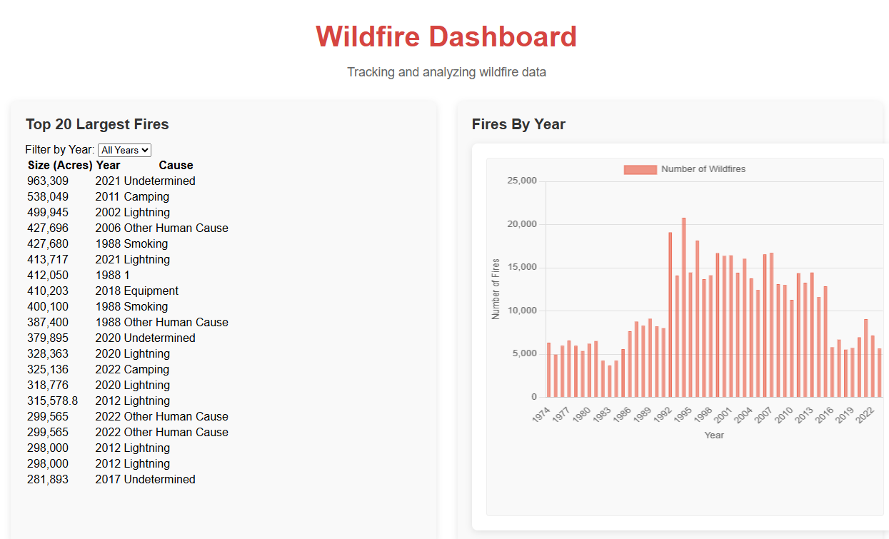

# Wildfire Dashboard 🌲🔥


An interactive dashboard visualizing wildfire data across the United States, featuring historical trends and top fire incidents.

  

## Features

- 📊 **Wildfires by Year**: Interactive bar chart showing fire frequency trends
- 🔥 **Top 20 Largest Fires**: Filterable table with acreage and cause data

## Live Demo

Experience the dashboard:  
👉 [https://carol-tsai.github.io/wildfire-dashboard/](https://carol-tsai.github.io/wildfire-dashboard/)

## Technologies Used

- React.js
- Chart.js (for data visualizations)
- GitHub Pages (for deployment)
- AWS API Gateway 
- AWS S3 
- AWS Athena 
- AWS Lambda 

## Data Source
[National USFS Fire Occurrence Point (Feature Layer)] (https://catalog.data.gov/dataset/national-usfs-fire-occurrence-point-feature-layer-d3233)

## Installation

To run locally:

```bash
git clone https://github.com/carol-tsai/wildfire-dashboard.git
cd wildfire-dashboard/frontend
npm install
npm start
```
MIT License